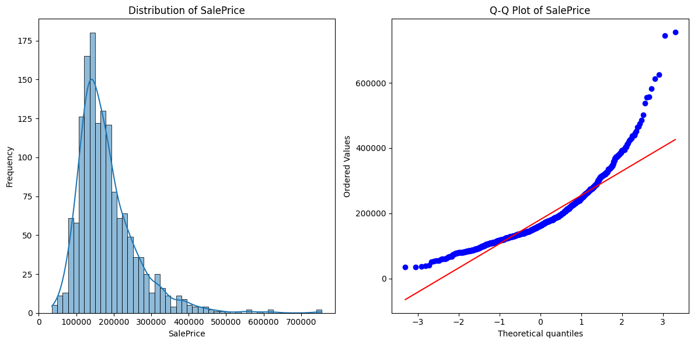
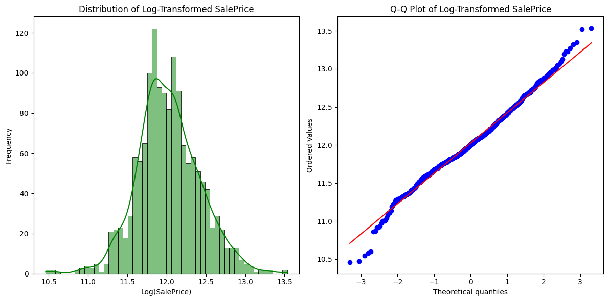
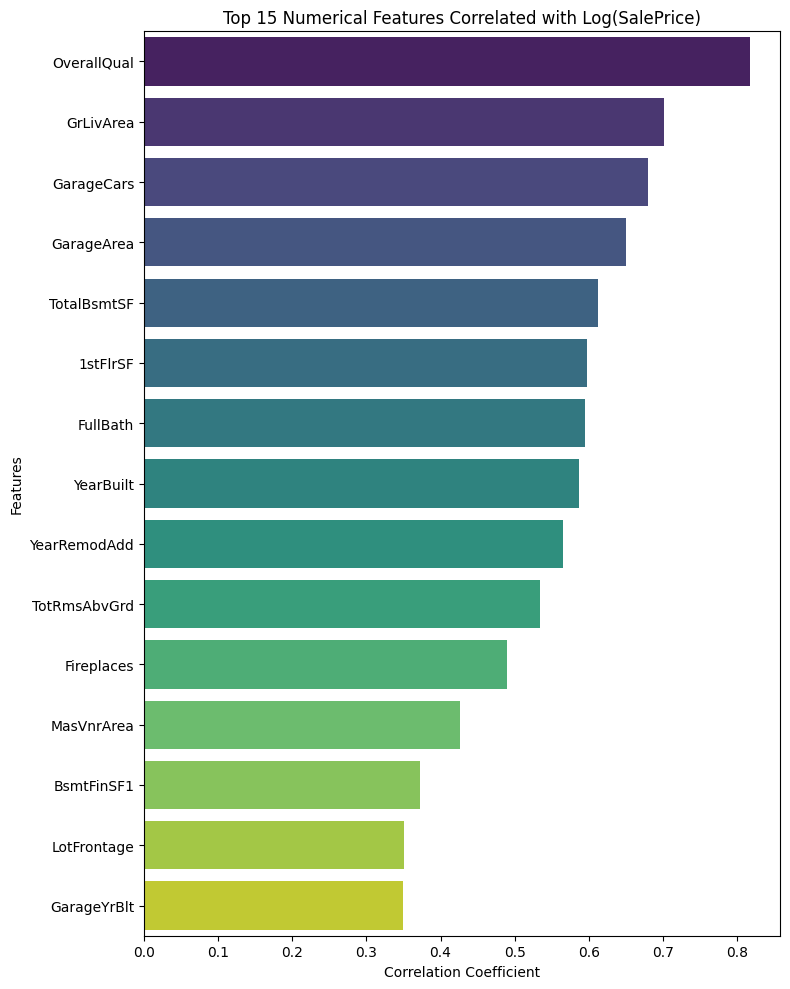
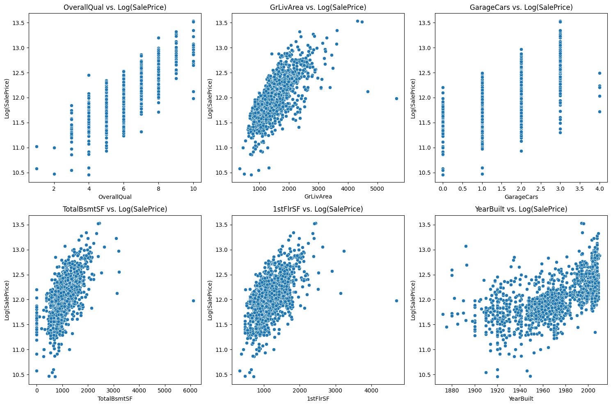
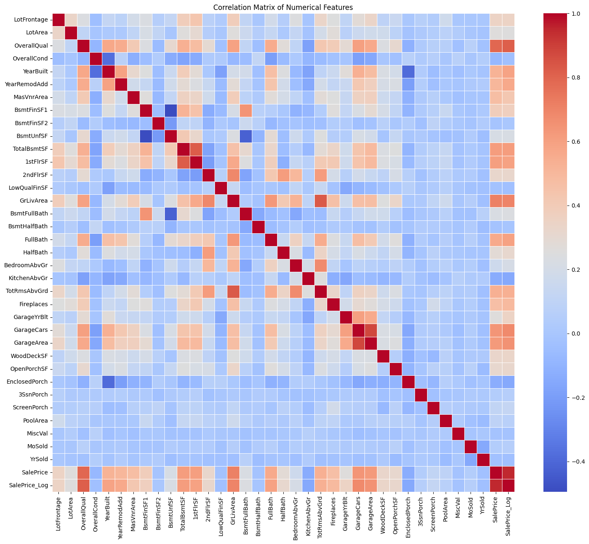
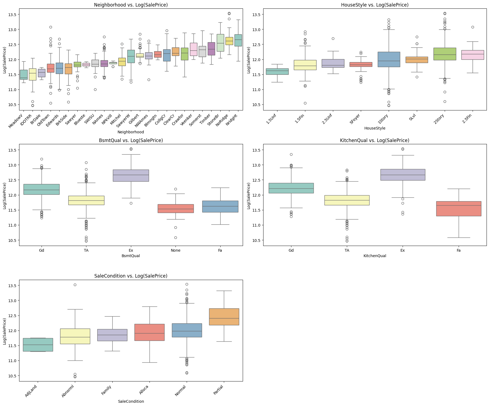

# House Prices: Advanced Regression Techniques - A Comprehensive Data Science Workflow

## Project Overview

This project tackles the Kaggle competition "House Prices: Advanced Regression Techniques." The primary goal is to predict the sale price of houses in Ames, Iowa, based on a wide array of features describing various aspects of residential homes. This repository documents a complete data science workflow, from initial data exploration and cleaning to feature engineering, model building, and evaluation.

The methodology emphasizes a step-by-step, detailed approach to understand the data intricacies and build a robust predictive model.

**Kaggle Competition Link:** [House Prices - Advanced Regression Techniques](https://www.kaggle.com/competitions/house-prices-advanced-regression-techniques)

## Table of Contents

1.  [Goal Definition](#goal-definition)
2.  [Environment Setup](#environment-setup)
3.  [Data Loading and Initial Exploration](#data-loading-and-initial-exploration)
4.  [Data Cleaning and Preprocessing](#data-cleaning-and-preprocessing)
    *   [Handling Missing Values](#handling-missing-values)
    *   [Data Type Correction](#data-type-correction)
5.  [Exploratory Data Analysis (EDA)](#exploratory-data-analysis-eda)
    *   [Target Variable Analysis (`SalePrice`)](#target-variable-analysis-saleprice)
    *   [Numerical Feature Analysis](#numerical-feature-analysis)
    *   [Categorical Feature Analysis](#categorical-feature-analysis)
6.  [Feature Engineering](#feature-engineering)
    *   [Handling Outliers](#handling-outliers)
    *   [Creating Age-Related Features](#creating-age-related-features)
    *   [Creating Aggregate Features (Total SF, Total Bath, etc.)](#creating-aggregate-features)
    *   [Polynomial Features](#polynomial-features)
7.  [Advanced Preprocessing for Modeling](#advanced-preprocessing-for-modeling)
    *   [Log Transformation of Skewed Numerical Predictors](#log-transformation-of-skewed-numerical-predictors)
    *   [One-Hot Encoding Categorical Features](#one-hot-encoding-categorical-features)
    *   [Data Splitting (Train/Test)](#data-splitting-traintest)
    *   [Feature Scaling](#feature-scaling)
8.  [Model Building and Evaluation](#model-building-and-evaluation)
    *   [Evaluation Metric](#evaluation-metric)
    *   [Cross-Validation Strategy](#cross-validation-strategy)
    *   [Model 1: Ridge Regression (Baseline)](#model-1-ridge-regression-baseline)
    *   [Model 2: LightGBM Regressor](#model-2-lightgbm-regressor)
9.  [Prediction and Submission File Generation](#prediction-and-submission-file-generation)
10. [Results Summary](#results-summary)
11. [Future Work and Potential Improvements](#future-work-and-potential-improvements)
12. [Repository Structure](#repository-structure)
13. [How to Run](#how-to-run)

---

## 1. Goal Definition

The objective is to predict the final sale price of each house (`SalePrice`) using the 79 explanatory variables describing (almost) every aspect of residential homes in Ames, Iowa. This is a regression problem.

---

## 2. Environment Setup

This project was developed primarily in a Jupyter Notebook environment (e.g., Google Colab). Key Python libraries used include:

*   **Data Manipulation:** `pandas`, `numpy`
*   **Visualization:** `matplotlib`, `seaborn`
*   **Statistical Analysis:** `scipy.stats`
*   **Machine Learning:** `scikit-learn`, `lightgbm`

A `requirements.txt` file can be generated to list specific versions if needed.

---

## 3. Data Loading and Initial Exploration

The dataset consists of `train.csv`, `test.csv`, `sample_submission.csv`, and `data_description.txt`.

*   **Data Loading:** `train.csv` and `test.csv` were loaded into pandas DataFrames.
*   **Initial Inspection:**
    *   `df.head()`: Viewed the first few rows.
    *   `df.info()`: Checked data types and non-null counts, identifying initial missing values.
    *   `df.describe()`: Obtained summary statistics for numerical and categorical features.
    *   `df.shape`: Noted the dimensions of the datasets (Train: 1460 rows, 81 columns; Test: 1459 rows, 80 columns).
*   **Data Description File (`data_description.txt`):** This file was extensively used to understand the meaning of each feature and the significance of `NA` values.

---

## 4. Data Cleaning and Preprocessing

This phase focused on preparing the data for analysis and modeling. To ensure consistency, training and test feature sets (excluding `Id` and `SalePrice`) were combined before preprocessing.

### 4.1. Handling Missing Values

A systematic approach was taken to impute missing values based on their meaning derived from `data_description.txt`:

*   **Features where `NA` means "None" (Absence of feature):**
    *   Categorical (e.g., `PoolQC`, `MiscFeature`, `Alley`, `Fence`, `FireplaceQu`, `GarageType`, `BsmtQual`, `MasVnrType`): Filled `NaN` with the string "None".
    *   Numerical (e.g., `MasVnrArea`, `GarageYrBlt`, `GarageCars`, `GarageArea`, basement SFs & baths): Filled `NaN` with 0, corresponding to the absence of the feature.
*   **`LotFrontage` (Numerical):** Imputed using the median `LotFrontage` grouped by `Neighborhood`, with a fallback to the global median if a neighborhood had no data.
*   **Categorical Features with Few `NaN`s (likely from test set):** Imputed with the mode of the respective column (e.g., `MSZoning`, `Utilities`, `Electrical`).

All missing values were successfully imputed across the combined dataset.

*(Optional: You could insert a table here showing the columns with missing values and the strategy used for each, or the final output confirming no missing values remain).*

### 4.2. Data Type Correction

*   **`MSSubClass`:** Although numerical, this feature represents dwelling types and was converted from `int64` to `object` (string) to be treated as a categorical feature.
*   Other data types (`int64`, `float64`, `object`) were reviewed and deemed appropriate after this correction.

---

## 5. Exploratory Data Analysis (EDA)

EDA was performed on the training portion of the data to understand distributions and relationships.

### 5.1. Target Variable Analysis (`SalePrice`)

*   **Distribution:** The `SalePrice` showed significant positive (right) skewness...
    
*   **Transformation:** A natural logarithm transformation (`np.log(SalePrice)`) was applied. The transformed target, `SalePrice_Log`, exhibited a much more symmetrical, normal-like distribution (skewness ~0.12, kurtosis ~0.81). This transformed target was used for modeling.
    

### 5.2. Numerical Feature Analysis

This section delves into the relationships between numerical predictor features and the log-transformed target variable (`SalePrice_Log`), as well as relationships among the numerical predictors themselves.

*   **Correlation with Target (`SalePrice_Log`):**
    The Pearson correlation coefficient was calculated between each numerical feature and `SalePrice_Log`.
    *   `OverallQual` exhibited the strongest positive correlation (0.82).
    *   Other features with significant positive correlations included `GrLivArea` (0.70), `GarageCars` (0.68), `GarageArea` (0.65), `TotalBsmtSF` (0.61), `1stFlrSF` (0.60), `FullBath` (0.59), and `YearBuilt` (0.59).
    *   The visualization below shows the top 15 numerical features ranked by their correlation with `SalePrice_Log`.

    

*   **Scatter Plots of Key Predictors vs. Target:**
    To visually inspect the nature of these relationships, scatter plots were generated for the most influential numerical predictors against `SalePrice_Log`.
    *   Features like `OverallQual`, `GrLivArea`, `TotalBsmtSF`, and `1stFlrSF` displayed clear positive linear trends with `SalePrice_Log`.
    *   `GarageCars` showed a stepped positive relationship, as expected for a discrete count.
    *   `YearBuilt` indicated a general positive trend (newer houses tend to be more expensive), though the relationship appeared less strictly linear, especially for much older homes.
    *   These plots also helped identify potential outliers, such as a few properties with very large `GrLivArea` but unexpectedly moderate `SalePrice_Log`.

    

*   **Multicollinearity Analysis:**
    To understand the inter-correlations among numerical predictor features, a heatmap of their correlation matrix was generated. This is crucial for identifying potential multicollinearity, which can affect the stability and interpretability of some regression models.
    *   Strong positive correlations (indicative of multicollinearity) were observed between several pairs of features, most notably:
        *   `GarageArea` and `GarageCars` (correlation coefficient: ~0.88)
        *   `TotRmsAbvGrd` and `GrLivArea` (correlation coefficient: ~0.83)
        *   `1stFlrSF` and `TotalBsmtSF` (correlation coefficient: ~0.82)
    *   These high correlations suggest that these pairs of features carry redundant information. While tree-based models are generally robust to multicollinearity, this would be a key consideration if using linear regression models, potentially requiring feature selection or dimensionality reduction.

    

### 5.3. Categorical Feature Analysis

The influence of categorical features on `SalePrice_Log` was investigated using box plots. These plots effectively visualize the distribution of the target variable across the different categories within each selected feature.

*   **Key Observations from Box Plots:**
    Several categorical features demonstrated a strong relationship with `SalePrice_Log`:
    *   **`Neighborhood`**: This feature proved to be a very strong predictor, with significant variations in median `SalePrice_Log` observed across different neighborhoods. Some neighborhoods (e.g., `NridgHt`, `NoRidge`) consistently commanded higher prices, while others (e.g., `MeadowV`, `IDOTRR`) were associated with lower prices. The variance in prices also differed, with some neighborhoods showing tighter price distributions than others.
    *   **Quality-related Features (`BsmtQual`, `KitchenQual`)**: A clear, monotonic positive trend was evident. Higher quality ratings (e.g., "Excellent" - `Ex`) for basements and kitchens consistently corresponded to higher median `SalePrice_Log` values compared to lower quality ratings (e.g., "Fair" - `Fa` or "Typical/Average" - `TA`).
    *   **`HouseStyle`**: Different dwelling styles were associated with different price ranges. For instance, "2.5Fin" (2 and 1/2 story finished) and "2Story" styles generally had higher median prices than styles like "1.5Unf" (1 and 1/2 story unfinished).
    *   **`SaleCondition`**: The condition of the sale also impacted prices. "Partial" sales (often new constructions) had the highest median `SalePrice_Log`, followed by "Normal" sales. "Abnormal" sales (e.g., foreclosures) and "Family" sales tended to have lower median prices.

*   **Implications for Modeling:**
    The distinct patterns observed confirm that these categorical features (and others not explicitly plotted but likely showing similar trends) are valuable predictors. They will require appropriate encoding (e.g., one-hot encoding) to be used in most machine learning models.

The following image presents a selection of these box plots, illustrating the relationship between key categorical features and `Log(SalePrice)`:



## 6. Feature Engineering

New features were created from existing ones to potentially improve model performance:

### 6.1. Handling Outliers

*   Two outliers in the training set with `GrLivArea > 4000` and relatively low `SalePrice_Log` were identified and removed to prevent them from unduly influencing models. The training set size was reduced from 1460 to 1458.

### 6.2. Creating Age-Related Features

*   `HouseAge = YrSold - YearBuilt`
*   `RemodelAge = YrSold - YearRemodAdd`
*   `GarageAge = YrSold - GarageYrBlt`
*   Data inconsistencies (e.g., negative ages, remodel before build, garage built in the future) were identified and corrected by capping ages at 0 or adjusting erroneous years.

### 6.3. Creating Aggregate Features

*   `TotalSF = TotalBsmtSF + GrLivArea`
*   `TotalPorchSF = OpenPorchSF + EnclosedPorch + 3SsnPorch + ScreenPorch`
*   `TotalBath = BsmtFullBath + 0.5 * BsmtHalfBath + FullBath + 0.5 * HalfBath`

### 6.4. Polynomial Features

*   Squared terms were created for key numerical predictors (`OverallQual_sq`, `GrLivArea_sq`, `TotalSF_sq`, `HouseAge_sq`, `GarageCars_sq`, `TotalBath_sq`) to help models capture potential non-linear relationships.

---

## 7. Advanced Preprocessing for Modeling

Final preprocessing steps applied to the feature-engineered dataset:

### 7.1. Log Transformation of Skewed Numerical Predictors

*   Numerical predictor features with absolute skewness > 0.75 were identified.
*   `np.log1p` (log(1+x)) transformation was applied to these features to reduce their skewness and make their distributions more symmetrical. This benefited 28 features.

### 7.2. One-Hot Encoding Categorical Features

*   All remaining `object` type (categorical) features were converted into numerical format using `pd.get_dummies()`. This expanded the feature set from 91 to 328 columns.

### 7.3. Data Splitting (Train/Test)

*   The processed and encoded dataset (`all_df_encoded`) was split back into `X_train_processed` (1458 samples) and `X_test_processed` (1459 samples).
*   The target variable `y_train_final` corresponds to `SalePrice_Log` for the 1458 training samples.

### 7.4. Feature Scaling

*   `StandardScaler` from `scikit-learn` was used to scale all numerical features.
*   The scaler was `fit` **only** on `X_train_processed` and then used to `transform` both `X_train_processed` and `X_test_processed` to prevent data leakage. This results in features with approximately zero mean and unit variance.

---

## 8. Model Building and Evaluation

### 8.1. Evaluation Metric

The primary evaluation metric is the **Root Mean Squared Logarithmic Error (RMSLE)**. Since the target variable (`y_train_final`) is already log-transformed, calculating the Root Mean Squared Error (RMSE) on this transformed target is equivalent to RMSLE on the original `SalePrice` scale.
`RMSE(log(Actual), log(Predicted))`

### 8.2. Cross-Validation Strategy

*   K-Fold Cross-Validation (with `n_splits=5`, shuffled) was used to evaluate model performance robustly.

### 8.3. Model 1: Ridge Regression (Baseline)

*   A Ridge Regression model (`alpha=1.0`) was trained and evaluated.
*   **Mean CV RMSE: 0.1301**
*   Std Dev CV RMSE: 0.0128

### 8.4. Model 2: LightGBM Regressor

*   A LightGBM Regressor model was trained with initial hyperparameters (e.g., `objective='regression_l1'`, `learning_rate=0.01`, `n_estimators=2000` for CV).
*   `lgb.cv` was used for cross-validation with early stopping (`stopping_rounds=100`).
*   The CV process determined an optimal number of boosting rounds (e.g., ~1997).
*   **Mean CV RMSE: 0.1213**
*   Std Dev CV RMSE: 0.0095

The LightGBM model showed a significant improvement over the Ridge Regression baseline.

---

## 9. Prediction and Submission File Generation

*   The final LightGBM model (trained on the full processed training data with the optimal number of estimators from CV) was used to predict `SalePrice_Log` on the processed test set (`X_test_np`).
*   Predictions were inverse-transformed using `np.exp()` to get actual sale prices.
*   A submission file `submission_lightgbm.csv` was generated with `Id` and predicted `SalePrice` columns.

---

## 10. Results Summary

| Model             | Mean CV RMSE (on Log(SalePrice)) | Std Dev CV RMSE |
| ----------------- | -------------------------------- | --------------- |
| Ridge Regression  | 0.1301                           | 0.0128          |
| **LightGBM**      | **0.1213**                       | **0.0095**      |

The LightGBM model provided the best performance with a mean cross-validated RMSE of approximately 0.1213. This score is a strong result for an initial modeling pass without extensive hyperparameter tuning.

---

## 11. Future Work and Potential Improvements

*   **Hyperparameter Tuning:** Systematically tune hyperparameters for LightGBM (and potentially other models like XGBoost, CatBoost) using GridSearchCV, RandomizedSearchCV, or Bayesian optimization (e.g., Optuna).
*   **Advanced Feature Engineering:**
    *   Explore more complex interaction terms (e.g., `OverallQual` with `GrLivArea`).
    *   Consider target encoding for high-cardinality categorical features (with careful handling of data leakage).
    *   Investigate binning of certain numerical or date features.
*   **Ensembling/Stacking:** Combine predictions from multiple diverse, strong models (e.g., weighted averaging, stacking regressor) to potentially improve robustness and accuracy.
*   **Error Analysis:** Deep dive into instances where the model makes large errors during cross-validation to identify patterns and guide further feature engineering or model adjustments.
*   **Alternative Models:** Experiment with other regression algorithms like XGBoost, CatBoost, or even Neural Networks if deemed appropriate.

---

## 13. How to Run

1.  **Clone the repository:**
    ```bash
    git clone <repository_url>
    cd <repository_name>
    ```
2.  **Set up the environment:**
    *   It is recommended to use a virtual environment (e.g., `venv` or `conda`).
    *   Install required packages:
        ```bash
        pip install -r requirements.txt
        ```
        *(If you create a `requirements.txt` file from your notebook environment: `pip freeze > requirements.txt`)*
3.  **Place data:** Ensure the `train.csv`, `test.csv`, etc., are in the `data/` directory.
4.  **Run the Jupyter Notebook:** Open and run the `notebooks/house_price_prediction.ipynb` notebook cell by cell. The notebook will guide through all steps from data loading to submission file generation.

---